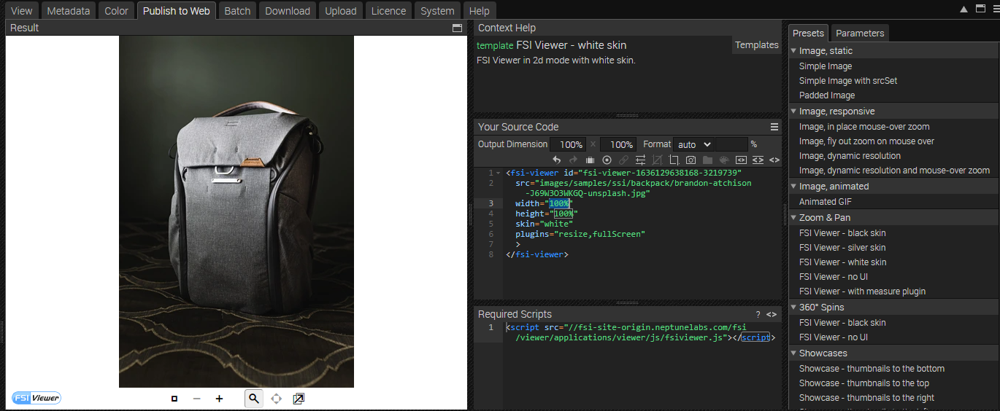
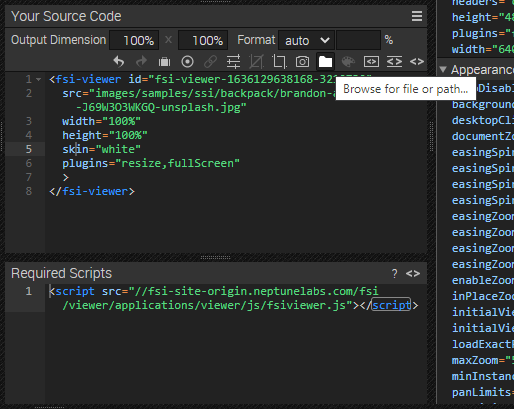
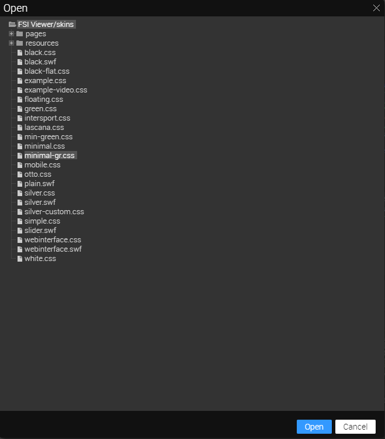
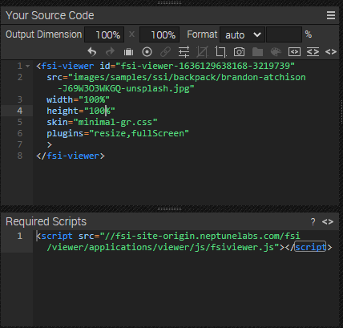

# Using FSI Viewer for Image Zoom - Custom Skin

This readme describes how the detail page example is achieved using _FSI Viewer_ and a custom skin.
The aim of the demo is to show how you can easily integrate images with zoom by just adding a simple
simple viewer tag.

# Adding your own skins

We have various tutorials on our website to help you learn how:

- [Adapt Skins](https://www.neptunelabs.com/fsi-viewer-js/creating-custom-skins-for-fsi-viewer-js/)
- [Make Advanced Custom Skins](https://www.neptunelabs.com/fsi-viewer-js/creating-advanced-custom-skins-fsi-viewer-js/)
- [Add Custom Buttons](https://www.neptunelabs.com/fsi-viewer-js/creating-custom-buttons-for-a-fsi-viewer-js-skin/)

For our example we have created custom buttons and followed the steps in the **Advanced Custom Skins** example.
The skin CSS needs to be stored on your FSI server in the following path **/\_viewers/skins/**

# Use Zoom on the website

With an image selected, you can see all the possible publishing options for that particular item by going to the Publish To Web tab.
For this example, select the _FSI Viewer - White Skin_ preset in the _Zoom & Pan_ section:



The _Skin_ section allows you to control the appearance of your viewer by setting the dimensions and format, as well as adding effects or cropping options.

Place your cursor on the Skin parameter and select the folder button at the top:



Select the skin you have created from the list and click **Open**:



You will now see the source code for your chosen publishing option, which includes your skin. You can edit and copy the images to publish them.
You will also see the necessary scripts that need to be embedded into the site.



To display zoom with FSI Viewer, all you need to do is add the script at the top of your website:

```html
<script
  src='https://fsi.domain.tld/fsi/viewer/applications/viewer/js/fsiviewer.js'
</script>
```

This will ensure that the FSI Viewer is loaded.

Next, you need to place the _<fsi-viewer>_ tag you see in the Publish section where you want the viewer to appear.
In our example this looks like this

```html
<fsi-viewer
  id="image"
  src="images/samples/ssi/backpack/brandon-atchison-J69W3O3WKGQ-unsplash.jpg"
  width="100%"
  height="100%"
  skin="minimal-gr"
  debug="true"
  plugins="resize,fullScreen"
  backgroundColor="#22261e"
>
</fsi-viewer>
```

For all the parameters that can be used, please refer to the [manual](https://docs.neptunelabs.com/fsi-viewer/latest/fsi-viewer).

## Testing with examples from your own server

To test the examples with images from your own [FSI Server](https://www.neptunelabs.com/fsi-server/), please first copy the env.yml.dist file to env.yml and adapt the file, then restart the main demo again.
