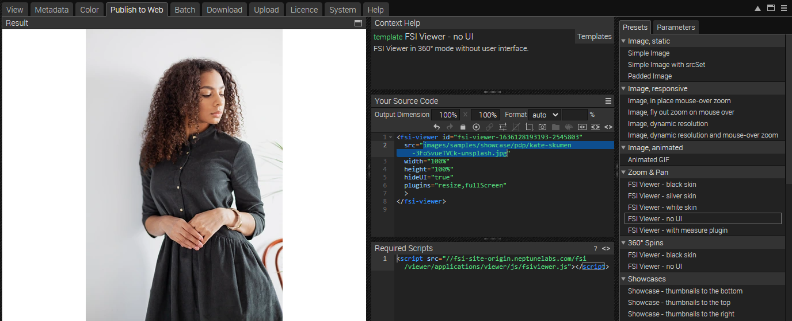
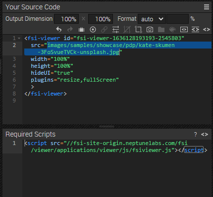

# Using FSI Viewer for Image Zoom - External Buttons

This readme describes how the detail page sample with *FSI Viewer* and minimalist external buttons is achieved.
The aim of the demo is to show how you can easily integrate images with zoom by just adding
a simple viewer tag and how to add external buttons to it.

# Use Zoom on the website

While having an image selected, you can see all possible publishing ways for the specific item by visiting the "Publish To Web" tab.
For this example, select the preset *FSI Viewer - no UI* in the section *Zoom & Pan*:



The *Source Code* section enables you to control the look of your viewer by setting the dimensions and format, as well as adding effects or crop options to it.
In this area you also can see the source code for your selected publishing option which you can edit and copy to publish the images.
You also see the required scripts which need to be embedded on the site.



In order to display zoom with FSI Viewer, you only need to add the corresponding script
to the head of your website:

```html
<script
  src='https://docs.neptunelabs.com/fsi/viewer/applications/viewer/js/fsiviewer.js'
</script>
```
This ensures that FSI Viewer is loaded.

Afterwards, you need to place the *<fsi-viewer>* tag you see in the Publish section on the place where you would like to see the viewer.
In our example this will look like this (it's important to choose no UI as a setting, ensuring **hideUI="true"** is set):

```html
<fsi-viewer id="image"
            src="images/samples/showcase/pdp/kate-skumen-3FoSvueTVCk-unsplash.jpg"
            width="100%"
            height="100%"
            plugins="resize,fullScreen"
            hideUI="true"
            backgroundColor="#f8f9fa"
>
</fsi-viewer>
```

# Adding external buttons

Then we need to add the button container:
```html
        <div class="position-absolute menu" id="myExternalButtons">
          <div style="font-size:32px" class="fsi-root fsi-viewer-root" id="myExternalMenuBar">
            <div fsi-cmd="ZoomOut" class="icon"></div>
            <div fsi-cmd="ZoomIn" class="icon" style="margin-right:0.1em" ></div>
          </div>
        </div>
```

We pass the ID of this div (**myExternalButtons**) to the FSI Viewer with the following parameter:

**externalButtonContainer="myExternalButtons"**

In order to hide external buttons which are not supposed to be seen in the viewer, we set the following function in our external.js:

```javascript
function showHideExternalButton(elButton, strButtonID, bPresentInViewer){
  if (!bPresentInViewer) elButton.style.display = "none";
  else elButton.style.display = "";
}
```

This function is called by setting the parameter **onAfterRegisterExternalButton="showHideExternalButton"**.

It's important to set **hideUI="true"** in order to hide the original skin.

By setting the external button div container to **position-absolute** and the FSI Viewer to **position:relative**, we ensure an overlay effect of the buttons.

The class **menu** serves for setting the position of the buttons (defined in external.css):
```css
.menu {
  top: 10px;
  left: 40px;
}
```

So the <fsi-viewer> tag needs to look like this:

```html
<fsi-viewer id="image"
            src="images/samples/showcase/pdp/kate-skumen-3FoSvueTVCk-unsplash.jpg"
            width="100%"
            height="100%"
            plugins="resize,fullScreen"
            hideUI="true"
            backgroundColor="#f8f9fa"
            style="position:relative;"
            externalButtonContainer="myExternalButtons"
            onAfterRegisterExternalButton="showHideExternalButton"
>
</fsi-viewer>
```

For all parameters which can be used, please consult the [manual](https://docs.neptunelabs.com/fsi-viewer/latest/fsi-viewer).

## Testing with examples from your own server

To test the examples with images from your own [FSI Server](https://www.neptunelabs.com/fsi-server/), please first copy the env.yml.dist file to env.yml and adapt the file, then restart the main demo again.
