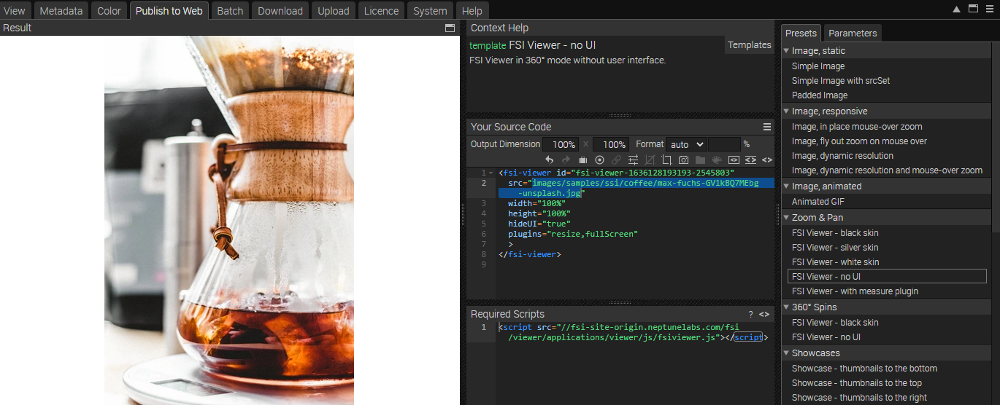

# Using FSI Viewer for Image Zoom - controlled by external slider

This readme describes how the detail page sample with *FSI Viewer* is achieved by adding a minimalist external slider.
The aim of the demo is to show how you can easily integrate images with zoom by just adding
a simple viewer tag.
Please note that this sample uses Bootstrap and JQuery.

# Add Zoom to the website

While having an image selected, you can see all possible publishing ways for the specific item by visiting the "Publish To Web" tab.
For this example, select the preset *FSI Viewer - no UI* in the section *Zoom & Pan*:



The *Source Code* section enables you to control the look of your viewer by setting the dimensions and format, as well as adding effects or crop options to it.
In this area you also can see the source code for your selected publishing option which you can edit and copy to publish the images.
You also see the required scripts which need to be embedded on the site.


In order to display zoom with FSI Viewer, you only need to add the corresponding script
to the head of your website:

```html
<script
  src='https://docs.neptunelabs.com/fsi/viewer/applications/viewer/js/fsiviewer.js'
</script>
```
This ensures that FSI Viewer is loaded.

Afterwards, you need to place the *<fsi-viewer>* tag you see in the Publish section on the place where you would like to see the viewer.
In our example this will look like this (it's important to choose no UI as a setting, ensuring **hideUI="true"** is set):

```html
  <fsi-viewer id="image"
              src="images/samples/ssi/coffee/max-fuchs-GV1kBQ7MEbg-unsplash.jpg"
              width="100%"
              height="100%"
              plugins="resize,fullScreen"
              hideUI="true"
              backgroundColor="#f8f9fa"
              style="position:relative;"
>
</fsi-viewer>
```

## Adding the external slider

Afterwards, the external slider input is implemented.

And add the input on the place where you would like to display the slider:
```html
<input type="range" class="form-range" id="js-zoomslider">
```

In our **script.js**, we add the required steps:

```javascript
const handleZoomChange = (fScale, fScaleMax, fPercent) => {
  if (bChangeFromSlider) return
  elSlider.value = fPercent
}

const handleSlider = (evt) => {
  bChangeFromSlider = true
  const fPercent = evt.target.value
  elViewer.setZoom(fPercent, false, false)
  bChangeFromSlider = false
}

addEventListener('DOMContentLoaded', (event) => {

  elViewer = document.getElementById('image')
  elViewer.addListener('onZoomChanging', handleZoomChange)

  elSlider = document.getElementById('js-zoomslider')

  $FSI.addEvent(elSlider, 'input', handleSlider)
})
```

For all the parameters that can be used, please refer to the [manual](https://docs.neptunelabs.com/fsi-viewer/latest/fsi-viewer).

## Testing with examples from your own server

To test the examples with images from your own [FSI Server](https://www.neptunelabs.com/fsi-server/), please first copy the env.yml.dist file to env.yml and adapt the file, then restart the main demo again.
