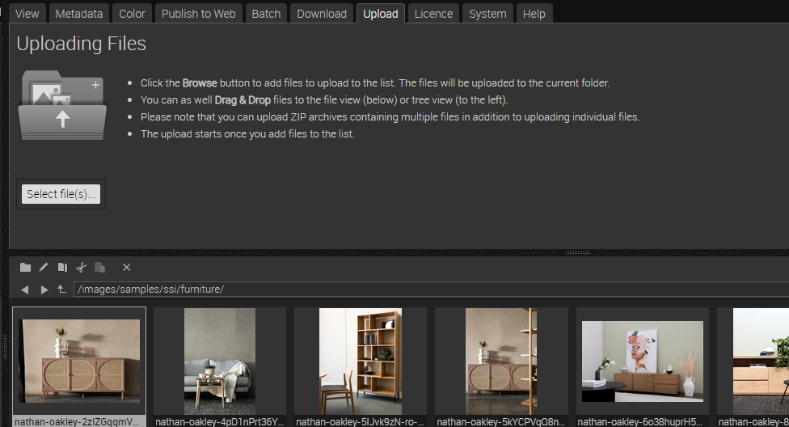

# Frontpage - Using FSI Viewer for Image Zoom - controlled by external slider

This readme describes how the detail page sample with *FSI Viewer* is achieved by adding an minimalist external slider.
The aim of the demo is to show how you can easily integrate images with zoom by just adding
a simple viewer tag.
Please note that this sample uses Bootstrap and JQuery.

# Add your images/ assets to FSI Server

First, you'll need to upload the images you want to use to FSI Server.
You can install a [demo version](https://www.neptunelabs.com/get/) via Docker or use our [online demo server](https://demo.fsi-server.com/fsi/interface/) to try it out first.

It's important to use the correct source connector for your images:

- *Storage*: images will be imported to the storage for high performance Single Source Imaging
- *Static*: for static files only, e.g. style graphics you want to use on your website

# Uploading images

Depending on the type of the selected source connector, you can upload different types of files. There are several possibilities to upload images into the interface.



- Choose the Upload tab, click the "Choose files" button to add files to upload to the list. The files will be uploaded to the current folder.
- Drag & Drop files to the file view or the tree view

# Use zoom on the website

While having an image selected, you can see all possible publishing ways for the specific item by visting the Publish To Web tab.
For this example, select the preset *FSI Viewer - white skin* in the section *Zoom & Pan*:


The *Source Code* section enables you to control the look of your viewer by setting the dimensions and format, as well as adding effects or crop options to it.
In this area you also can see the source code for your selected publishing option which you can edit and copy to publish the images.
You also see the required scripts which need to be embedded on the site.


In order to display zoom with FSI Viewer, you only need to add the corresponding script
to the head of your website:

```html
<script
  src='https://fsi-site.neptunelabs.com/fsi/viewer/applications/viewer/js/fsiviewer.js'
</script>
```
This ensures that FSI Viewer is loaded.

Afterwards, you need to place the *<fsi-viewer>* tag you see in the Publish section on the place where you would like to see the viewer.
In our example this will look like this:

```html
  <fsi-viewer id="image"
              src="images/samples/ssi/coffee/max-fuchs-GV1kBQ7MEbg-unsplash.jpg"
              width="100%"
              height="100%"
              plugins="resize,fullScreen"
              hideUI="true"
              backgroundColor="#f8f9fa"
              debug="true"
              style="position:relative;"
>
</fsi-viewer>
```

##Adding the external slider

Afterwards, the external slider input is implemented.
Add JQuery to the head of the document:
```html
<script src="https://ajax.googleapis.com/ajax/libs/jquery/3.6.0/jquery.min.js"></script>
```

And add the input on the place where you would like to display the slider:
```html
<input type="range" class="form-range" id="js-zoomslider">
```

In the **body** tag, two functions are loaded. switchImageSample controls the thumbnails on the side of the viewer, initSlider controls the
external slider. For this tutorial we only focus on initSlider.
```html
<body class="bg-light" onload="initSlider();switchImageSample();">
```

In our **external.js**, we add the corresponding function:

```javascript
function initSlider() {
  new ZoomSliderControl(
    document.getElementById('image'),
    document.getElementById('js-zoomslider')
  );
}
```
First, we get the viewer and slider element by their ID.

```javascript
  var ZoomSliderControl = function(elViewer, elSlider){
  var bChangeFromSlider;

  var init = function(){
  $FSI.addEvent(elSlider, 'input', handleSlider);
  elViewer.addListener('onZoomChanging', handleZoomChange);
}

```
We add an input event to the slider as well as a listener on the viewer detecting a zoom change.

```javascript
  var handleZoomChange = function(fScale, fScaleMax, fPercent) {
  if (bChangeFromSlider) return;
  elSlider.value = fPercent;
};

  var handleSlider = function(evt){
  bChangeFromSlider = true;
  var fPercent = evt.target.value;
  elViewer.setZoom(fPercent, false, false);
  bChangeFromSlider = false;
};

  init();
};
```
The elViewer.setZoom sets the FSI Viewer zoom level according to the slider input value.

The function scheme is as follows:

```javascript
setZoom(fZoomPercent, bPreliminary, bAnimate)
```
Parameters:
**nZoom** is a float, range: [0..100]

**bPreliminary** is a boolean, if set to true, image tiles are loaded.

**bAnimate** is a boolean, if set to false, the magnification is set immediately.

For all parameters which can be used, please consult the [manual](https://docs.neptunelabs.com/fsi-viewer/latest/fsi-viewer).

## Testing with examples from your own server

To test the examples with images from your own [FSI Server](https://www.neptunelabs.com/fsi-server/), please first copy the env.yml.dist file to env.yml and adapt the file, then restart the main demo again.
