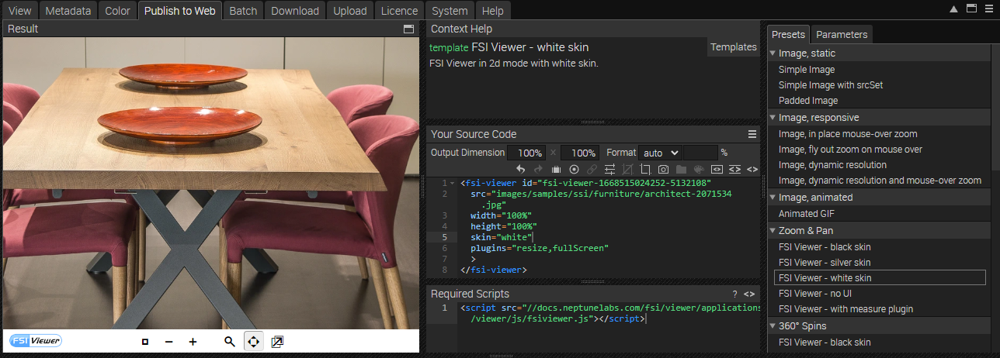
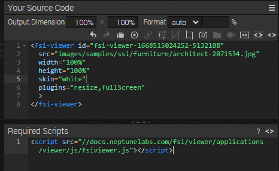

# Using FSI Viewer for Image Zoom - Modal Version

This readme describes how the detail page sample with *FSI Viewer* in a modal is achieved.
The aim of the demo is to show how you can easily integrate images with zoom by just adding
a simple viewer tag.
Please note that this sample uses the Bootstrap modal.

# Add a static image to website - modal on click

Next, we will add an image which will open a modal on click. Please keep in mind we are using the Bootstrap modal technique.

```html
<div class="col-sm-7" data-bs-toggle="modal" data-bs-target="#exampleModal" >
        
      </div>
```

The modal itself is defined at the end of the <main> section.
The data-bs-target as seen above has to have the same name as the ID of your modal div.


```html
<div id="exampleModal" class="modal fade bd-example-modal-xl" tabindex="-1" role="dialog" aria-labelledby="myExtraLargeModalLabel" aria-hidden="true">
    <div class="modal-dialog modal-xl">
      <div class="modal-content">
        <div class="modal-header">
          <button type="button" class="btn-close" data-bs-dismiss="modal" aria-label="Close"></button>
        </div>
        <div class="modal-body">
          <fsi-viewer id="img-viewer"
                      plugins="fullScreen,resize"
                      skin="white" width="1100px" height="700px"
                      src="images/samples/ssi/furniture/nathan-oakley-o4s4AfTgOvg-unsplash.jpg">
          </fsi-viewer>
        </div>
      </div>
    </div>
  </div>
```
The modal-body also contains the basic FSI Viewer tag.
The next section shows how you extract the viewer tag from FSI Server.

# Use zoom on the website

While having an image selected, you can see all possible publishing ways for the specific item by visting the Publish To Web tab.
For this example, select the preset *FSI Viewer - white skin* in the section *Zoom & Pan*:



The *Source Code* section enables you to control the look of your viewer by setting the dimensions and format, as well as adding effects or crop options to it.
In this area you also can see the source code for your selected publishing option which you can edit and copy to publish the images.
You also see the required scripts which need to be embedded on the site.



In order to display zoom with FSI Viewer, you only need to add the corresponding script
to the head of your website:

```html
<script
  src='https://docs.neptunelabs.com/fsi/viewer/applications/viewer/js/fsiviewer.js'
</script>
```
This ensures that FSI Viewer is loaded.

Afterwards, you need to place the *<fsi-viewer>* tag you see in the Publish section in the modal body.
In our example this will look like this, as seen above:

```html
<fsi-viewer
  id="img-viewer"
  plugins="fullScreen,resize"
  skin="white" width="1100px" height="700px"
  src="images/samples/ssi/furniture/nathan-oakley-o4s4AfTgOvg-unsplash.jpg">
</fsi-viewer>
```

For all parameters which can be used, please consult the [manual](https://docs.neptunelabs.com/fsi-viewer/latest/fsi-viewer).

# Switching the images

Switching the images is achieved by the onClick function set in the tumbnails on the right:

```html
<div class="row pb-3">
  <div class="col-4">
    
  </div>
  <div class="col-4" >
    

  </div>
  <div class="col-4" >
    
  </div>
</div>
```

In our *modal,js* the changeImage function contains both the functionalty to change the normal image and the image which is shown in the modal viewer:

```javascript
function changeImage(buttonID) {
let img;
let src;
let curImage = document.getElementById('image');
switch (buttonID) {
case "0":
img =  '//docs.neptunelabs.com/fsi/server?type=image&source=images/samples/ssi/furniture/nathan-oakley-o4s4AfTgOvg-unsplash.jpg&width=940';
src = 'images/samples/ssi/furniture/nathan-oakley-o4s4AfTgOvg-unsplash.jpg';
break
case "1":
img = '//docs.neptunelabs.com/fsi/server?type=image&source=images/samples/ssi/furniture/nathan-oakley-jSbBnR22cXc-unsplash.jpg&width=940&rect=0,0.29634,1,0.66709';
src = 'images/samples/ssi/furniture/nathan-oakley-jSbBnR22cXc-unsplash.jpg';
break
case "2":
img = '//docs.neptunelabs.com/fsi/server?type=image&source=images/samples/ssi/furniture/nathan-oakley-CZysNmnvEJg-unsplash.jpg&width=940';
src = 'images/samples/ssi/furniture/nathan-oakley-CZysNmnvEJg-unsplash.jpg';
break
default:
img = '//docs.neptunelabs.com/fsi/server?type=image&source=images/samples/ssi/furniture/nathan-oakley-o4s4AfTgOvg-unsplash.jpg&width=940';
src = 'images/samples/ssi/furniture/nathan-oakley-o4s4AfTgOvg-unsplash.jpg';
}
curImage.src = img;
document.getElementsByTagName("fsi-viewer")[0].changeConfig(undefined, {imagesrc: src});
}
```


## Testing with examples from your own server

To test the examples with images from your own [FSI Server](https://www.neptunelabs.com/fsi-server/), please first copy the env.yml.dist file to env.yml and adapt the file, then restart the main demo again.
