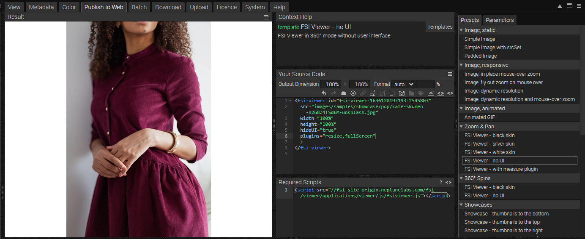
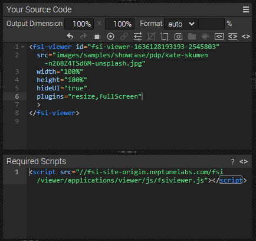

# Using FSI Viewer for Image Zoom - No Interface

This readme describes how to achieve the detail page example with *FSI Viewer* without using an interface.
The aim of the demo is to show how you can easily integrate images with zoom by just adding a simple
simple viewer tag.

# Add zoom to the website
With an image selected, you can see all the possible publishing options for that particular item by going to the Publish To Web tab.
For this example, select the *FSI Viewer - No UI* preset in the *Zoom & Pan* section:



The Source Code section allows you to control the appearance of your viewer by setting the dimensions and format, as well as adding effects or cropping options.
This section also displays the source code for your chosen publishing option, which you can edit and copy to publish the images.
You will also see the necessary scripts that need to be embedded in the page.



To display zoom with FSI Viewer, all you need to do is add the script
at the top of your website:

```html
<script
  src='https://docs.neptunelabs.com/fsi/viewer/applications/viewer/js/fsiviewer.js'
</script>
```
This will ensure that the FSI Viewer is loaded.

Next, you need to place the *<fsi-viewer>* tag you see in the Publish section where you want the viewer to appear.
In our example this looks like this

```html
 <fsi-viewer id="image"
             src="images/samples/showcase/pdp/kate-skumen-glmDobIx4o0-unsplash.jpg"
             width="100%"
             height="100%"
             plugins="resize,fullScreen"
             hideUI="true"
             backgroundColor="#f8f9fa"
             style="position:relative;"
>
</fsi-viewer>
```
## Displaying the viewer without interface
To ensure that no interface is shown, you'll need to add **hideUI="true"** to the parameter list as shown above.

For a full list of parameters that can be used, please refer to the [manual](https://docs.neptunelabs.com/fsi-viewer/latest/fsi-viewer).

## Testing with examples from your own server

To test the examples with images from your own [FSI Server](https://www.neptunelabs.com/fsi-server/), please first copy the env.yml.dist file to env.yml and adapt the file, then restart the main demo again.
