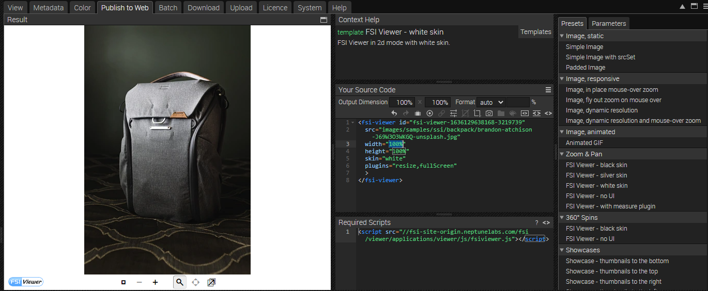
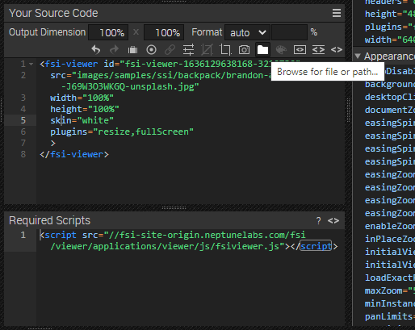
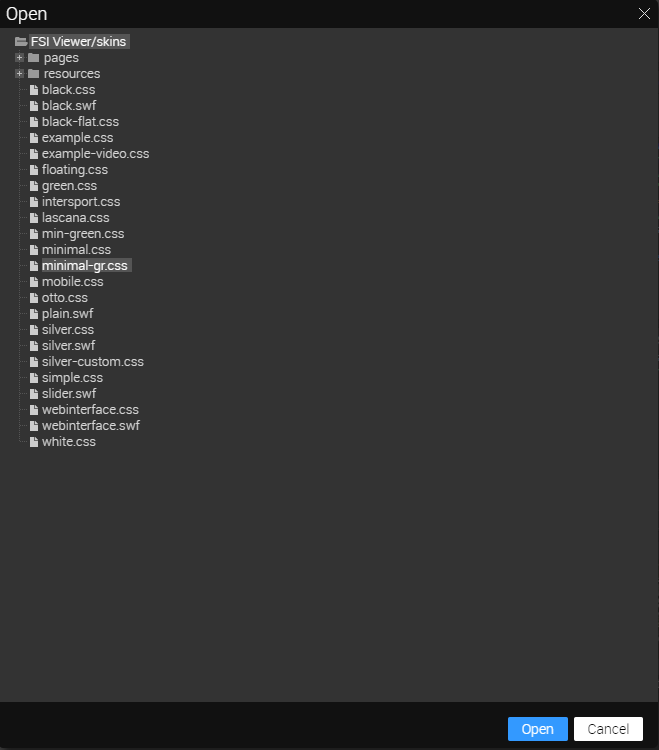
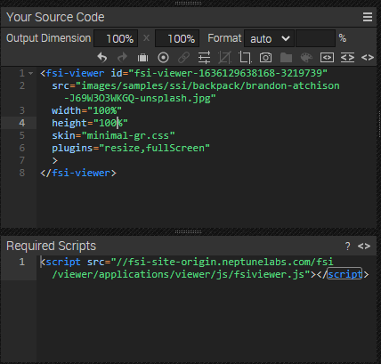

# Frontpage - Using FSI Viewer for Image Zoom - Custom Skin

This readme describes how the detail page sample with *FSI Viewer* and a custom skin is achieved.
The aim of the demo is to show how you can easily integrate images with zoom by just adding
a simple viewer tag.

# Add your images/ assets to FSI Server

First, you'll need to upload the images you want to use to FSI Server.
You can install a [demo version](https://www.neptunelabs.com/get/) via Docker or use our [online demo server](https://demo.fsi-server.com/fsi/interface/) to try it out first.

It's important to use the correct source connector for your images:

- *Storage*: images will be imported to the storage for high performance Single Source Imaging
- *Static*: for static files only, e.g. style graphics you want to use on your website

# Uploading images

Depending on the type of the selected source connector, you can upload different types of files. There are several possibilities to upload images into the interface.


- Choose the Upload tab, click the "Choose files" button to add files to upload to the list. The files will be uploaded to the current folder.
- Drag & Drop files to the file view or the tree view

# Adding your own skins

We have various tutorials on our website where you learn how to:

- [Adapt Skins](https://www.neptunelabs.com/fsi-viewer-js/creating-custom-skins-for-fsi-viewer-js/)
- [Make Advanced Custom Skins](https://www.neptunelabs.com/fsi-viewer-js/creating-advanced-custom-skins-fsi-viewer-js/)
- [Add Custom Buttons](https://www.neptunelabs.com/fsi-viewer-js/creating-custom-buttons-for-a-fsi-viewer-js-skin/)

For our example, we created custom buttons and followed the steps in the **Advanced Custom Skins** example.
The skin CSS needs to be stored in your FSI Server at the following path: **/_viewers/skins/**

# Use Zoom on the website

While having an image selected, you can see all possible publishing ways for the specific item by visiting the "Publish To Web" tab.
For this example, select the preset *FSI Viewer - white skin* in the section *Zoom & Pan*:



The *Source Code* section enables you to control the look of your viewer by setting the dimensions and format, as well as adding effects or crop options to it.

Place your cursor on the skin parameter, and then select the folder button above:



Choose the skin you have created on the list and select **Open**:


You can now see the source code for your selected publishing option which includes your skin. You can edit and copy to publish the images.
You also see the required scripts which need to be embedded on the site.



In order to display zoom with FSI Viewer, you only need to add the corresponding script
to the head of your website:

```html
<script
  src='https://fsi-site.neptunelabs.com/fsi/viewer/applications/viewer/js/fsiviewer.js'
</script>
```
This ensures that FSI Viewer is loaded.

Afterwards, you need to place the *<fsi-viewer>* tag you see in the Publish section on the place where you would like to see the viewer.
In our example this will look like this:

```html
       <fsi-viewer id="image"
                   src="images/samples/ssi/backpack/brandon-atchison-J69W3O3WKGQ-unsplash.jpg"
                   width="100%"
                   height="100%"
                   skin="minimal-gr"
                   debug="true"
                   plugins="resize,fullScreen"
                   backgroundColor="#22261e"
>
</fsi-viewer>
```

For all parameters which can be used, please consult the [manual](https://docs.neptunelabs.com/fsi-viewer/latest/fsi-viewer).

## Testing with examples from your own server

To test the examples with images from your own [FSI Server](https://www.neptunelabs.com/fsi-server/), please first copy the env.yml.dist file to env.yml and adapt the file, then restart the main demo again.
