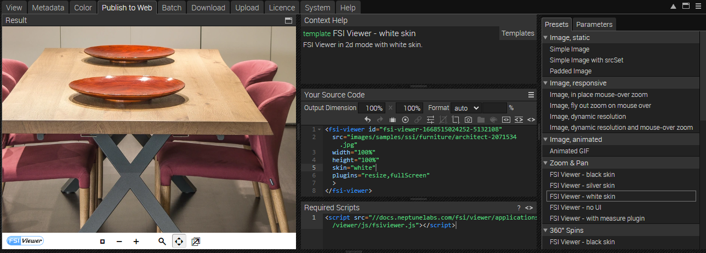
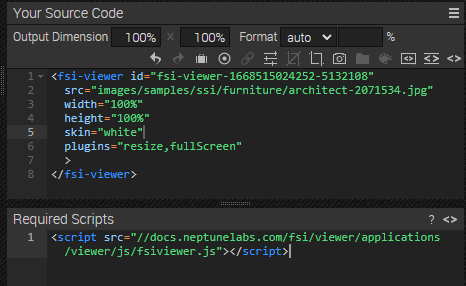

# Using FSI Viewer for Image Zoom - Modal Version

This readme describes how to achieve the detail page example using *FSI Viewer* in a modal.
The aim of the demo is to show how you can easily integrate images with zoom by adding a simple viewer tag.
Please note that this example uses the bootstrap modal.

# Add a static image to website - modal on click
We will add an image that opens a modal when clicked. Please note that we are using the bootstrap modal technique.
```html
<div class="col-sm-7" data-bs-toggle="modal" data-bs-target="#exampleModal" >
        
      </div>
```

The modal itself is defined at the end of the <main> section.
The data-bs target, as seen above, must have the same name as the ID of your modal div.

```html
<div id="exampleModal" class="modal fade bd-example-modal-xl" tabindex="-1" role="dialog" aria-labelledby="myExtraLargeModalLabel" aria-hidden="true">
    <div class="modal-dialog modal-xl">
      <div class="modal-content">
        <div class="modal-header">
          <button type="button" class="btn-close" data-bs-dismiss="modal" aria-label="Close"></button>
        </div>
        <div class="modal-body">
          <fsi-viewer id="img-viewer"
                      plugins="fullScreen,resize"
                      skin="white" width="1100px" height="700px"
                      src="images/samples/ssi/furniture/nathan-oakley-o4s4AfTgOvg-unsplash.jpg">
          </fsi-viewer>
        </div>
      </div>
    </div>
  </div>
```
The modal body also contains the basic FSI Viewer tag.
The next section shows how to extract the Viewer tag from FSI Server.

# Use zoom on the website
With an image selected, you can see all the possible publishing options for that particular item by going to the Publish To Web tab.
For this example, select the *FSI Viewer - White Skin* preset in the *Zoom & Pan* section:



The *Source Code* section enables you to control the look of your viewer by setting the dimensions and format, as well as adding effects or crop options to it.
In this area you also can see the source code for your selected publishing option which you can edit and copy to publish the images.
You also see the required scripts which need to be embedded on the site.



In order to display zoom with FSI Viewer, you only need to add the corresponding script
to the head of your website:

```html
<script
  src='https://docs.neptunelabs.com/fsi/viewer/applications/viewer/js/fsiviewer.js'
</script>
```
This will ensure that the FSI Viewer is loaded.

Next, you need to place the *<fsi-viewer>* tag you see in the Publish section into the modal body.
In our example, this will look like the above:

```html
<fsi-viewer
  id="img-viewer"
  plugins="fullScreen,resize"
  skin="white" width="1100px" height="700px"
  src="images/samples/ssi/furniture/nathan-oakley-o4s4AfTgOvg-unsplash.jpg">
</fsi-viewer>
```

For all parameters which can be used, please refer to the [manual](https://docs.neptunelabs.com/fsi-viewer/latest/fsi-viewer).

# Switching the images
The images can be toggled using the onClick function set in the right-hand tabs:

```html
<div class="row pb-3">
  <div class="col-4">
    
  </div>
  <div class="col-4" >
    

  </div>
  <div class="col-4" >
    
  </div>
</div>
```
In our *script.js*, the changeImage function contains the functionality to change both the normal image and the image shown in the modal viewer:

```javascript
function changeImage(buttonID) {
let img;
let src;
let curImage = document.getElementById('image');
switch (buttonID) {
case "0":
img =  '//docs.neptunelabs.com/fsi/server?type=image&source=images/samples/ssi/furniture/nathan-oakley-o4s4AfTgOvg-unsplash.jpg&width=940';
src = 'images/samples/ssi/furniture/nathan-oakley-o4s4AfTgOvg-unsplash.jpg';
break
case "1":
img = '//docs.neptunelabs.com/fsi/server?type=image&source=images/samples/ssi/furniture/nathan-oakley-jSbBnR22cXc-unsplash.jpg&width=940&rect=0,0.29634,1,0.66709';
src = 'images/samples/ssi/furniture/nathan-oakley-jSbBnR22cXc-unsplash.jpg';
break
case "2":
img = '//docs.neptunelabs.com/fsi/server?type=image&source=images/samples/ssi/furniture/nathan-oakley-CZysNmnvEJg-unsplash.jpg&width=940';
src = 'images/samples/ssi/furniture/nathan-oakley-CZysNmnvEJg-unsplash.jpg';
break
default:
img = '//docs.neptunelabs.com/fsi/server?type=image&source=images/samples/ssi/furniture/nathan-oakley-o4s4AfTgOvg-unsplash.jpg&width=940';
src = 'images/samples/ssi/furniture/nathan-oakley-o4s4AfTgOvg-unsplash.jpg';
}
curImage.src = img;
document.getElementsByTagName("fsi-viewer")[0].changeConfig(undefined, {imagesrc: src});
}
```

## Testing with examples from your own server

To test the examples with images from your own [FSI Server](https://www.neptunelabs.com/fsi-server/), please first copy the env.yml.dist file to env.yml and adapt the file, then restart the main demo again.
